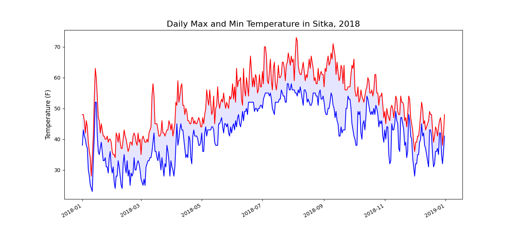
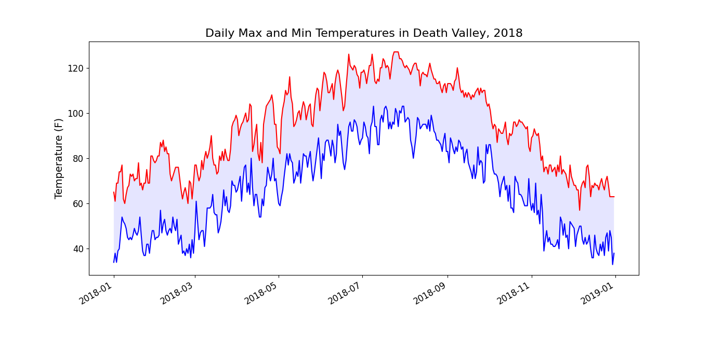
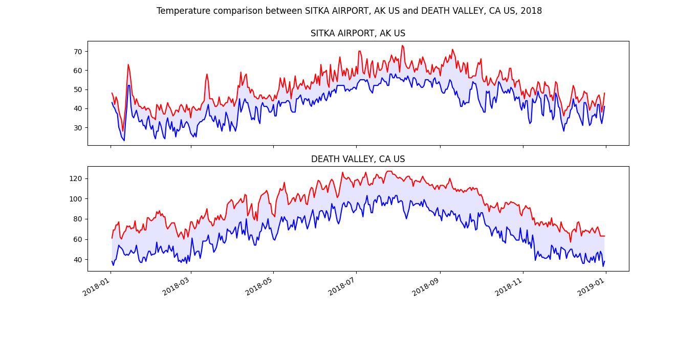

# Python Demo: CSV + Matplotlib

This project has two sample datasets stored in CSV files. The goal was to import
data from the CSV files and visualize them using python to derive any insight.

## Daily Temperature in Sitka

One CSV file contains daily temperature data of Sitka Airport, Alaska, USA in
2018. Maximum and minimum temperatures along with dates were scrapped from the
CSV file and plotted using the Matplotlib library.

**Observations:**
* The maximum temperature barely went above 70F and the minimum temperature
  stayed below 60F during Summer in 2018
* If we consider any temperature above 75F to be hot and below 75F to be cold,
  Sitka has mostly cold weather throughout the year

## Daily Temperature in Death Valley

Another CSV file contains daily temperature data of Death Valley, California,
USA in 2018. Maximum and minimum temperatures along with dates were scrapped
from the CSV file and plotted using the Matplotlib library.

**Observations:**
* The maximum temperature went above 120F and the minimum temperature went close
  to 100F during Summer in 2018
* If we consider any temperature above 75F to be hot and below 75F to be cold,
  Death Valley has mostly hot weather throughout the year

## Temperature Comparison Between Sitka and Death Valley

Using the two CSV files mentioned above, two subplots were drawn using the
Matplotlib library to compare the temperatures between Sitka and Death Valley in
2018.

**Observations:**
* Sitka has colder weather compared to Death Valley throughout the year
* The gap between daily maximum and minimum temperature in Death Valley is
  bigger compared to Sitka